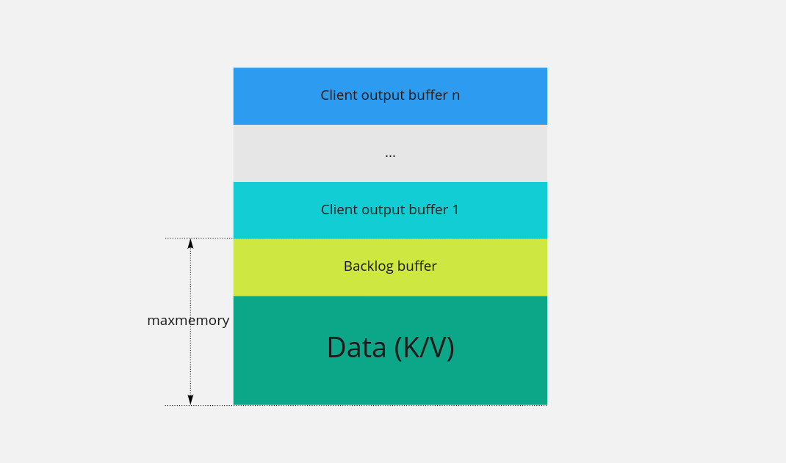
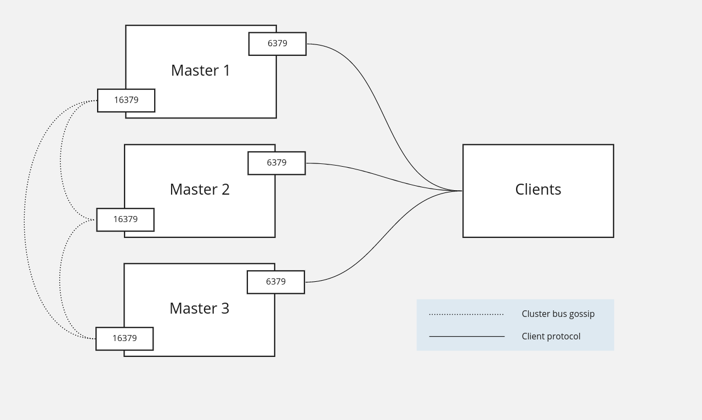
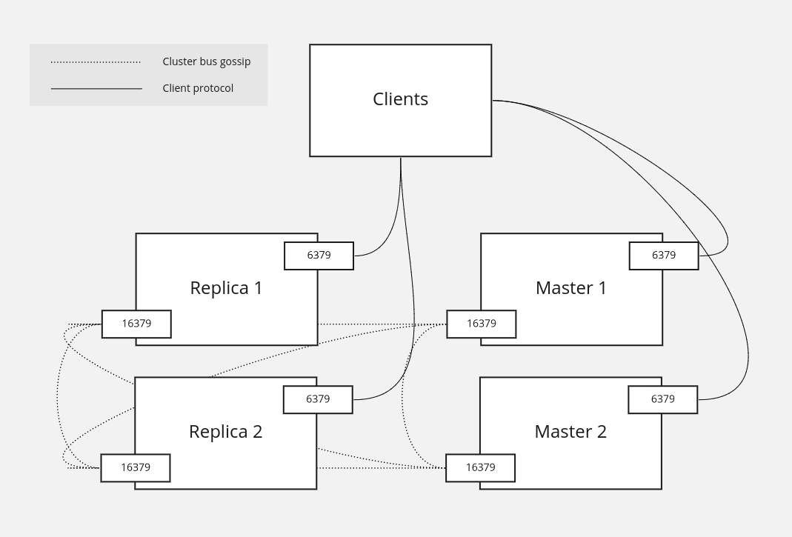
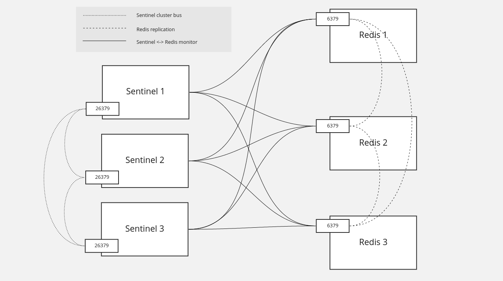
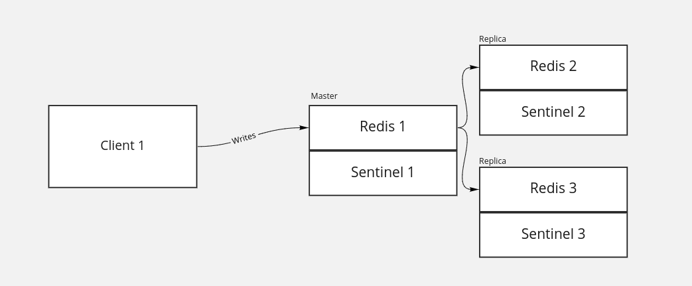
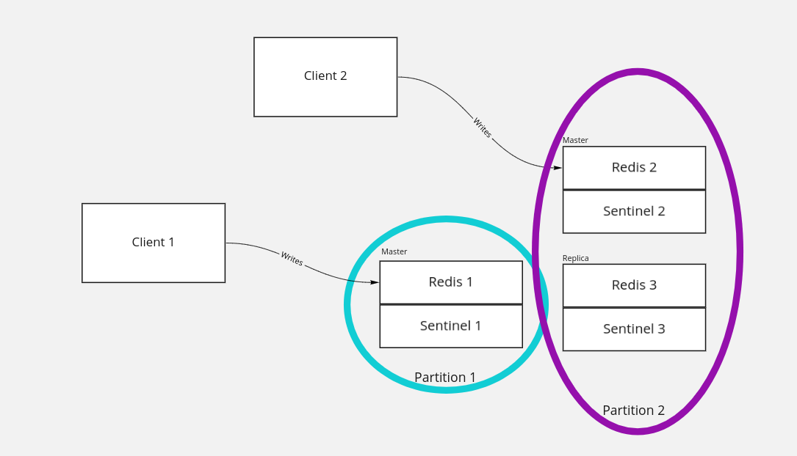

## Redis - no so boring

Konstanty Karagiorgis

Marcin Malczewski

---

## Agenda

- what is it and general features
- replication - cluster and sentinel
- persistence
- pubsub
- LRU/LFU cache
- grouping redis commands


---
<!-- What is it section -->
### What is it

Redis is an open source (BSD licensed), in-memory data structure store, used as a database, cache, and message broker

---

<!-- General featurs -->
### General features

* k/v store for strings, sets, lists, hashes (map/dict)
* pubsub
* ACLs


---

<!-- Redis replication section -->
### Replication

----

#### Replication backlog

Replication backlog is a circular buffer (FIFO), where each Redis instance keeps its most recent writes

----
#### Full vs. Partial sync

Depending on current replica state related to master, upon connection it can use:
* Partial sync if replica's state is within master's replication backlog
* Full RDB snapshot sync from master
    * Beware of timeouts!

----
#### Client output buffer

Each redis client has it's own output buffer (default limit 256MB), where Redis main thread writes data, that is then asynchronously transferred to the socket by other thread


----
#### Total memory usage of replicated Redis





---

<!-- Redis cluster section -->
### Clustering

Redis Cluster


----

#### Basic info

* sharding across nodes
* online resharding
* some degree of partition tolerance


----
#### Sharding



----
#### Sharding - hash slots

Each key is assigned to one of 16384 hash slots. To compute hash slot for given key, we calculate CRC16 for given key and take its modulo 16384

----
#### Hash slots example

Hash slots are distributed between the master nodes. For example if we have three master nodes, we can allocate the hash slots as follows:

* Master[0] -> Slots 0 - 5460
* Master[1] -> Slots 5461 - 10922
* Master[2] -> Slots 10923 - 16383

----
#### Hash slots allocation

Hash slots allocation is not automatic and must be configured when cluster is created. Assigning a hash slot to master node is done by connecting to the node and invoking `CLUSTER ADDSLOTS` command
```
# https://redis.io/commands/cluster-addslots

CLUSTER ADDSLOTS 1 2 3  # and so on
```

----
#### Sharding limitations 1

Clients connecting to Redis in cluster mode must be cluster aware, which means:

* Hash slots awareness and CRC16 calculated on client side
* The need to understand `MOVED` commands if the node the client would like to perform operation on is not able to complete it

----
#### Sharding limitations 2

Transactions, multiple key operations and LUA scripts can be only used with keys from the same hash slot. There is a possibility of enforcing placement on the same hash slot using hash tags (a `{...}` sub-string that happens to be identical for each key that should be placed on the same hash slot)

----
#### Cluster model



----
#### Cluster - replicas

* Each master node can have from 0 to n replicas (formerly slaves, currently both terms are used)
* Replicas can be be read from, providing that client explicitly declares, that it's `READONLY`. Otherwise all operations on replica will be `MOVED` to master, telling the client to reconnect
* In case of master failure, replica can be elected a new master for specific hash slots (failover)

----
#### Redis cluster demo

* `READONLY` and non-`READONLY` replica `GET` attempts
* replica `SET` attempt
* connecting via redis-cli with and without `-c` parameter, trying to fetch data outside of owned hash slot range


---

<!-- Redis sentinel section -->
### Clustering

Redis Sentinel

----

#### Basic info

* Clustering solution for Redis
* Master / replica (formerly slave) architecture
* Automatic failover when master fails


----

#### Sentinel diagram



----

#### Sentinel fundamentals

* Sentinel process is independent of Redis, can be even deployed on separate machine
* One sentinel can monitor multiple Redis clusters
* Sentinels form a cluster, that monitors and configures Redis master and replicas

----
#### Replication configuration for sentinel

```
sentinel monitor clustername 192.168.0.5 6379 2

# Can be skipped if using `SLAVEOF MASTER` in replica
sentinel known-slave clustername 192.168.0.6 6379
```

Sentinel detects other sentinels and replicas using redis pub/sub mechanism

----
#### Sentinel example




----
#### Sentinel example




----
#### Replication tuning

```
# Accept writes only if this many replicas
min-slaves-to-write 1

# Have lag lesser than that many seconds
min-slaves-max-lag 30

# Also applicable in Redis Cluster!
```

---

<!-- Persistence section -->
### Persistence

To RDB or to AOF?

----
#### Redis Database

Point-in-time snapshots of your dataset at specified interval

* small size
* uses fork and shares memory pages with parent process
* doesn't affect performance heavily
* it makes sense to perform the snapshot every x minutes, so not all data is persisted

----
#### Append only file

* flushes every write to disk in for of log
* can be synchronous or periodic, eg. every 1 second
* automatically rewritten after it gets big

---

<!-- PubSub section -->

### Pub/Sub

Publish/Subscribe messaging

----

#### Pub/Sub

Asynchronous messaging service that decouples services that produce events from services that process events.

- send updated data from server to one or multiple clients (WebSockets, SSE)
- implement chat functionality - sending one message to multiple users (broadcast)


----
#### Messages

* mechanism implemented by following commands: `SUBSCRIBE`/`PSUBSCRIBE`, `UNSUBSCRIBE`/`PUNSUBSCRIBE`, `PUBLISH`
* published messages are characterized into channels

----

#### Message format

Message is an [array replay](https://redis.io/topics/protocol#array-reply) with three elements.
There are three types of messages: *subscribe*, *message*, *unsubscribe*.

----

##### Subscribe

- succesfully subscribed to channel
- first param is the type of message, second the channel name and third represents the number of channels we are currently subscribed to

```
> SUBSCRIBE pubsub
1) "subscribe"
2) "pubsub"
3) (integer) 1

```
----

##### Unsubscribe

- succesfully unsubscribed from the channel
- first param is the type of message, second the channel name and the third represents the number of channels we are currently subscribed to

```
> UNSUBSCRIBE pubsub
1) "unsubscribe"
2) "pubsub"
3) (integer) 0
```

----

##### Message

- message received as a result of `PUBLISH` command run by another client
- first name is the type of message, second the channel and the third is a message payload

```
1) "message"
2) "pubsub"
3) "{\"data\": {\"message\": \"hello\"}, \"type\": \"pubsub\"}"
```

----

#### Pattern-matching subscriptions

The Redis Pub/Sub implementation supports pattern matching. Clients may subscribe to glob-style patterns in order to receive all the messages sent to channel names matching a given pattern.

```
PSUBSCRIBE pub*
PUNSUBSCRIBE pub*
```

----

##### Pmessage

- Messages received as a result of pattern matching are sent in a different format
- first param is the type of the message, second is the original pattern matched, third is the name of the originating channel and the last is the payload

```
1) "pmessage"
2) "pub*"
3) "pubsub"
4) "{\"data\": {\"message\": \"hello\"}, \"type\": \"pubsub\"}
```

----

#### Multiple matchings

Client may receive a single message multiple times if:
- it is subscribed to multiple patterns matching a published message
- it is subscribed to both patterns and channels matching message

----

#### PubSub demo

- basic implementation of SSE using redis pubsub

---
<!-- LRU section -->

### LRU/LFU cache


----

#### Maxmemory directive

- the *maxmemory* directive is used to use a specific amount of memory for data set.
- setting *maxmemory* to zero results into no memory limits (default on 64 bit system, on 32 bit system 3GB is used)
- when the limits is reached, it is possible to select different behavious (policies) - see *maxmemory-policy* directive

----
#### Eviction policies

Some policies use TTL for keys to determine which values should be evicted.
You can specify timeout in seconds for key during creation

```
SET mykey "Hello" EX 10
TTL mykey
```

or using `EXPIRE` command
```
EXPIRE mykey 10
```
----
#### Eviction policies

- **noeviction** - return error when the memory limit is reached
- **allkeys-lru** - evict keys by trying to remove the less recently used (LRU) keys first
- **volatile-lru** - evict keys by trying to remove LRU keys, but only among the keys that have an *expire set*
- **allkeys-random** - evict keys randomly

----

#### Eviction policies

- **volatile-random** - evict keys randomly, but only evict keys with an *expire set*
- **volatile-ttl** - evict keys with an *expire set*, and try to evict keys with a shorter TTL first

The policies **volatile-lru**, **volatile-random** and **volatile-ttl** behave like **noeviction** if there are no keys to evict matching the prerequisites.
The default policy is **noeviction**.


----

#### Eviction policies (4.0)

Starting with Redis version 4.0, a new LFU (Least Frequently Used) eviction policies was added.

- **volatile-lfu** - evict using approximated LFU among the keys with an *expire set*.
- **alkeys-lfu** - evict any key using approximated LFU

----

#### How eviction works

- redis try to run a an approximation of the LRU algorithm, by sampling a small number of keys, and evicting the ones with the oldest access time among the sampled keys
- to tune algorithm precision it is possible to set number of samples to check for every eviction *maxmemory-samples*
- redis does not use a true LRU implementation because it costs more  memory

----

#### How eviction works

- LFU uses propabilistic [Morris counter](https://en.wikipedia.org/wiki/Approximate_counting_algorithm),
 in order to keep object access frequency. It is combined with a decay period so the counter is reduced over time.

----
#### How eviction works


LFU has additional configurable parameters

```
# how many hits are needed in order to saturate the frequency
# counter (logaritmic scale - 1 milion)
lfu-log-factor 10

# amount of minutes a counter should be decayed,
# when sampled and found to be older that that value
lfu-decay-time 1
```


---
<!-- Grouping command section -->

### Grouping redis commands

pipelining, transactions and Lua scripting


----

#### Pipelining

- multiple commands are send in the same message, separated by newline ("batching")
- servers buffers all responses in memory and sends all at once when the pipeline is done
- pipelining is not atomic
- pipelining is non-blocking

----

#### Pipelining

```bash
redis-cli -c -h cluster-redis-cluster --pipe << EOF
SET mykey "Hello"
EXPIRE mykey 10
TTL mykey
EOF
```

----
#### Pipelining (use cases)

- you need performance
- you have several commands to send to the server
- you don't need the responses of the previous command as an input for subsequent command
- you don't need atomic operations - redis may interleave other operations between the pipelined ones.

----

#### Transactions

- all the commands in a transaction are serialized and executed sequentially
- either all of the commands or none are processed
- started by *MULTI* command and executed by *EXEC*
- transactions are stateful on the server, it actually keep track of an ongoing transaction

----
#### Transactions

- transactions are bloking - with slow transaction other clients will wait
- you can't use intermediate values from subsequent commands (only the list of the responses)
- there is no rollback mechanism like in traditional RDBMS

----
#### Transactions

```
MULTI
INCR counter1
INCR counter2
EXEC
```

----
#### Transactions

- transactions provide a "check-and-set" with the *WATCH* command (prevent race conditions) - parallel modification of keys will cause transaction to fail.

```
WATCH mykey
val = GET mykey
val = val + 1
MULTI
SET mykey $val
EXEC
```

----
#### Transactions

```python
r = redis.Redis()
p = r.pipeline()
try:
    p.watch('mykey') # watch for changes of this key
    val = p.get('mykey')
    p.multi() # start transaction
    val = int(val) + 1
    p.set('mykey', str(val))
    p.execute() # end transaction
except WatchError:
    print('`mykey` has been modified')
```


----
#### Transactions (use cases)

- you need atomic execution of commands
- you don't need intermediate values to compose subsequent commands

----

#### Lua scripts

- from version 2.6.0 redis server has embedded Lua interpreter
- lua script is loaded on the server and can be later invoked with params (*EVALSH* and *EVAL* commands)
- lua scripts are atomic
- scripts are blocking - this can case performance issue if script is slow


----
#### Lua scripts

- scripts are able to both read and write data with minimal latency (read, compute, write operattions are fast) - in pipelining the client needs the reply of the read command before it can call the write command.
- is it possible to manipulate intermediate commands results (unlike with pipelining and transations)
- is it possible to execute any Redis command inside the script


----

#### Lua scripts

```
RPUSH region:eu-west count:ireland count:london count:paris
MGET count:ireland
MGET count:london
MGET count:paris
```

```
cat << EOF > /tmp/example.lua
redis.call('ECHO', 'Increment all subcounters in ' .. KEYS[1])
local count=0
local broadcast=redis.call("LRANGE", KEYS[1], 0,-1)
for _,key in ipairs(broadcast) do
    redis.call("INCR",key)
    redis.call('ECHO', 'Increment counter ' .. key)
    count=count+1
end
return count
EOF
```

```
redis-cli -c -h cluster-redis-cluster --eval /tmp/example.lua region:eu-west
```

----

### Lua scripts (use cases)

- you need atomic execution of commands
- you need intermediate values to compose subsequent commands
- you need intermediate values to conditionally execute commands

---

### Questions
