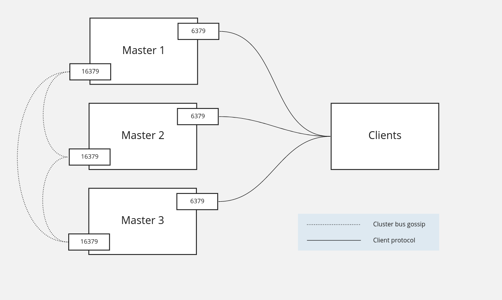

## Redis - no so boring

Konstanty Karagiorgis

Marcin Malczewski

---

## Agenda

- what is it and general features
- replication - sentiner vs cluster
- persistence
- security - pre 6.0 hacks and 6.0+ ACLs

---
<!-- What is it section -->
### What is it

---

<!-- Generat featurs -->
### General features

---

<!-- Redis cluster section -->
### Clustering

Redis Cluster

----

#### Basic info

* sharding across nodes
* online resharding
* some degree of partition tolerance


----
#### Sharding



----
#### Sharding - hash slots

Each key is assigned to one of 16384 hash slots. To compute hash slot for given key, we calculate CRC16 for given key and take its modulo 16384

----
#### Hash slots example

Hash slot ranges are distributed between the master nodes. For example if we have three master nodes, we can allocate the hash slots as follows:

* Master[0] -> Slots 0 - 5460
* Master[1] -> Slots 5461 - 10922
* Master[2] -> Slots 10923 - 16383

----
#### Hash slots allocation

Hash slots allocation is not automatic and must be configured when cluster is created. Assigning a hash slot to master node is done by connecting to the node and invoking `CLUSTER ADDSLOTS` command
```
# https://redis.io/commands/cluster-addslots

CLUSTER ADDSLOTS 1 2 3  # and so on
```

----
#### Sharding limitations 1

Clients connecting to Redis in cluster mode must be cluster aware, which means:

* The need to understand `MOVED` commands if the node the client would like to perform operation on is not able to complete it
* Hash slots awareness and CRC16 calculated on client side

----
#### Sharding limitations 2

Transactions, multiple key operations and LUA scripts can be only used with keys from the same hash slot. There is a possibility of enforcing placement on the same hash slot using hash tags (a `{...}` sub-string that happens to be identical for each key that should be placed on the same hash slot)

----
#### Replication model


----
#### Replication - replicas

* Each master node can have from 0 to n replicas (formerly slaves, currently both terms are used)
* Replicas can be be read from, providing that client explicitly declares, that it's `READONLY`. Otherwise all operations on replica will be `MOVED` to master, telling the client to reconnect
* In case of master failure, replica can be elected a new master for specific hash slots (failover)

----
#### Redis cluster demo

* `READONLY` and non-`READONLY` replica `GET` attempts
* replica `SET` attempt
* connecting via redis-cli with and without `-c` parameter, trying to fetch data outside of owned hash slot range


---

<!-- Persistence section -->
### Presistence

persistence

---
<!-- Security section -->
### Security

----

#### Pre 6.0 hacks

----

#### 6.0+ ACLs
