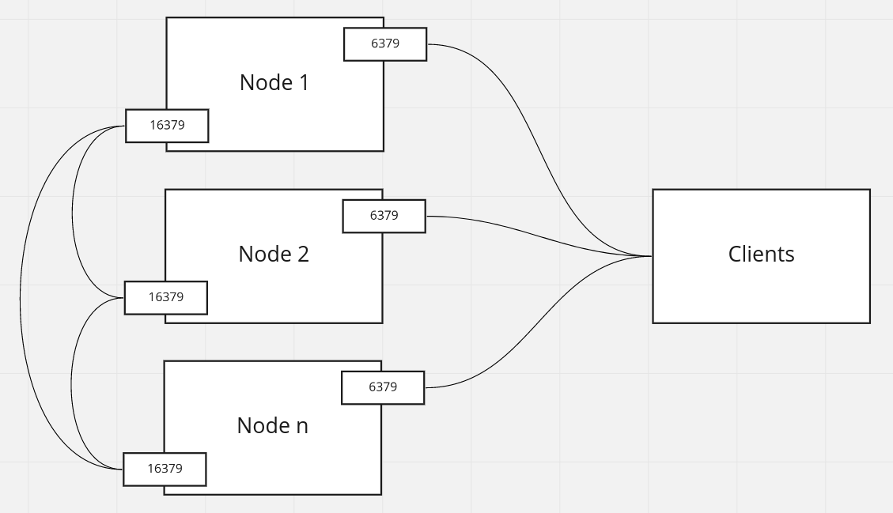

## Redis - no so boring

Konstanty Karagiorgis

Marcin Malczewski

---

## Agenda

- what is it and general features
- replication - sentiner vs cluster
- persistence
- security - pre 6.0 hacks and 6.0+ ACLs

---
<!-- What is it section -->
### What is it

---

<!-- Generat featurs -->
### General features

---

<!-- Redis cluster section -->
### Clustering

Redis Cluster

----

#### Basic info

* automatical sharding across nodes
* some degree of partition tolerance


----
#### Ports



----
#### Sharding - hash slots

Each key is assigned to one of 16384 hash slots. To compute hash slot for given key, we calculate CRC16 for given key and take its module 16384.

----
#### Hash slots example

Hash slot ranges are distributed between the master nodes. For example if we have three master nodes, we can allocate the hash slots as follows:

* Master[0] -> Slots 0 - 5460
* Master[1] -> Slots 5461 - 10922
* Master[2] -> Slots 10923 - 16383


----
#### Hash slots allocation

Hash slots allocation is not automatic and must be configured when cluster is created. Assigning a hash slot to master node is done by connecting to the node and invoking `CLUSTER ADDSLOTS` command.
```
# https://redis.io/commands/cluster-addslots

CLUSTER ADDSLOTS 1 2 3  # and so on
```


---

<!-- Persistence section -->
### Presistence

persistence

---
<!-- Security section -->
### Security

----

#### Pre 6.0 hacks

----

#### 6.0+ ACLs
